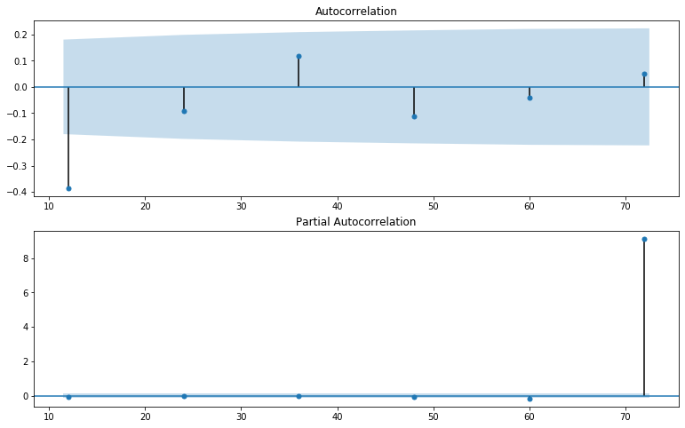

# Zillow Time Series


```python
jupyter nbconvert Decorators.ipynb --to md
```


      File "<ipython-input-1-557b37e0f9e6>", line 1
        jupyter nbconvert Decorators.ipynb --to md
                        ^
    SyntaxError: invalid syntax


<h1>Table of Contents<span class="tocSkip"></span></h1>
<div class="toc"><ul class="toc-item"><li><span><a href="#Zillow-Time-Series" data-toc-modified-id="Zillow-Time-Series-1"><span class="toc-item-num">1&nbsp;&nbsp;</span>Zillow Time Series</a></span></li><li><span><a href="#Imports" data-toc-modified-id="Imports-2"><span class="toc-item-num">2&nbsp;&nbsp;</span>Imports</a></span></li><li><span><a href="#Gather-Data" data-toc-modified-id="Gather-Data-3"><span class="toc-item-num">3&nbsp;&nbsp;</span>Gather Data</a></span></li><li><span><a href="#Helper-Functions" data-toc-modified-id="Helper-Functions-4"><span class="toc-item-num">4&nbsp;&nbsp;</span>Helper Functions</a></span></li><li><span><a href="#Choosing-Top-5-Zipcodes" data-toc-modified-id="Choosing-Top-5-Zipcodes-5"><span class="toc-item-num">5&nbsp;&nbsp;</span>Choosing Top 5 Zipcodes</a></span></li><li><span><a href="#Data-Preperation-and-Analysis" data-toc-modified-id="Data-Preperation-and-Analysis-6"><span class="toc-item-num">6&nbsp;&nbsp;</span>Data Preperation and Analysis</a></span><ul class="toc-item"><li><span><a href="#Checking-Seasonality" data-toc-modified-id="Checking-Seasonality-6.1"><span class="toc-item-num">6.1&nbsp;&nbsp;</span>Checking Seasonality</a></span></li><li><span><a href="#Checking-Monthly-Returns" data-toc-modified-id="Checking-Monthly-Returns-6.2"><span class="toc-item-num">6.2&nbsp;&nbsp;</span>Checking Monthly Returns</a></span></li><li><span><a href="#Checking-for-Stationarity" data-toc-modified-id="Checking-for-Stationarity-6.3"><span class="toc-item-num">6.3&nbsp;&nbsp;</span>Checking for Stationarity</a></span></li><li><span><a href="#Modeling-Each-Zipcode" data-toc-modified-id="Modeling-Each-Zipcode-6.4"><span class="toc-item-num">6.4&nbsp;&nbsp;</span>Modeling Each Zipcode</a></span><ul class="toc-item"><li><span><a href="#Charleston-29407" data-toc-modified-id="Charleston-29407-6.4.1"><span class="toc-item-num">6.4.1&nbsp;&nbsp;</span>Charleston 29407</a></span></li><li><span><a href="#Alexandria-56308" data-toc-modified-id="Alexandria-56308-6.4.2"><span class="toc-item-num">6.4.2&nbsp;&nbsp;</span>Alexandria 56308</a></span></li></ul></li></ul></li><li><span><a href="#Facebook-Prophet-Model" data-toc-modified-id="Facebook-Prophet-Model-7"><span class="toc-item-num">7&nbsp;&nbsp;</span>Facebook Prophet Model</a></span><ul class="toc-item"><li><span><a href="#Charleston-29407-FB" data-toc-modified-id="Charleston-29407-FB-7.1"><span class="toc-item-num">7.1&nbsp;&nbsp;</span>Charleston 29407 FB</a></span></li><li><span><a href="#Alexandria-FB" data-toc-modified-id="Alexandria-FB-7.2"><span class="toc-item-num">7.2&nbsp;&nbsp;</span>Alexandria FB</a></span></li></ul></li></ul></div>

# Imports


```python
import pandas as pd
import numpy as np
import matplotlib.pyplot as plt
from matplotlib import pyplot
from statsmodels.tsa.stattools import adfuller
from statsmodels.graphics.tsaplots import plot_acf
from statsmodels.graphics.tsaplots import plot_pacf
from statsmodels.tsa.arima_model import ARIMA
from statsmodels.tsa.statespace.sarimax import SARIMAX
from statsmodels.tsa.seasonal import seasonal_decompose
from sklearn.metrics import mean_squared_error as MSE
```

# Gather Data


```python
# Loading Data. Data Has been obtained from https://www.zillow.com/research/data/
zillow_data = pd.read_csv('zillow_data.csv')
#Removing RegionID because RegionName is proper ZipCode
zillow_data.drop(columns = 'RegionID', inplace=True)
zillow_data.head()
```


<div>
<style scoped>
    .dataframe tbody tr th:only-of-type {
        vertical-align: middle;
    }

    .dataframe tbody tr th {
        vertical-align: top;
    }

    .dataframe thead th {
        text-align: right;
    }
</style>
<table border="1" class="dataframe">
  <thead>
    <tr style="text-align: right;">
      <th></th>
      <th>RegionName</th>
      <th>City</th>
      <th>State</th>
      <th>Metro</th>
      <th>CountyName</th>
      <th>SizeRank</th>
      <th>1996-04</th>
      <th>1996-05</th>
      <th>1996-06</th>
      <th>1996-07</th>
      <th>...</th>
      <th>2017-07</th>
      <th>2017-08</th>
      <th>2017-09</th>
      <th>2017-10</th>
      <th>2017-11</th>
      <th>2017-12</th>
      <th>2018-01</th>
      <th>2018-02</th>
      <th>2018-03</th>
      <th>2018-04</th>
    </tr>
  </thead>
  <tbody>
    <tr>
      <td>0</td>
      <td>60657</td>
      <td>Chicago</td>
      <td>IL</td>
      <td>Chicago</td>
      <td>Cook</td>
      <td>1</td>
      <td>334200.0</td>
      <td>335400.0</td>
      <td>336500.0</td>
      <td>337600.0</td>
      <td>...</td>
      <td>1005500</td>
      <td>1007500</td>
      <td>1007800</td>
      <td>1009600</td>
      <td>1013300</td>
      <td>1018700</td>
      <td>1024400</td>
      <td>1030700</td>
      <td>1033800</td>
      <td>1030600</td>
    </tr>
    <tr>
      <td>1</td>
      <td>75070</td>
      <td>McKinney</td>
      <td>TX</td>
      <td>Dallas-Fort Worth</td>
      <td>Collin</td>
      <td>2</td>
      <td>235700.0</td>
      <td>236900.0</td>
      <td>236700.0</td>
      <td>235400.0</td>
      <td>...</td>
      <td>308000</td>
      <td>310000</td>
      <td>312500</td>
      <td>314100</td>
      <td>315000</td>
      <td>316600</td>
      <td>318100</td>
      <td>319600</td>
      <td>321100</td>
      <td>321800</td>
    </tr>
    <tr>
      <td>2</td>
      <td>77494</td>
      <td>Katy</td>
      <td>TX</td>
      <td>Houston</td>
      <td>Harris</td>
      <td>3</td>
      <td>210400.0</td>
      <td>212200.0</td>
      <td>212200.0</td>
      <td>210700.0</td>
      <td>...</td>
      <td>321000</td>
      <td>320600</td>
      <td>320200</td>
      <td>320400</td>
      <td>320800</td>
      <td>321200</td>
      <td>321200</td>
      <td>323000</td>
      <td>326900</td>
      <td>329900</td>
    </tr>
    <tr>
      <td>3</td>
      <td>60614</td>
      <td>Chicago</td>
      <td>IL</td>
      <td>Chicago</td>
      <td>Cook</td>
      <td>4</td>
      <td>498100.0</td>
      <td>500900.0</td>
      <td>503100.0</td>
      <td>504600.0</td>
      <td>...</td>
      <td>1289800</td>
      <td>1287700</td>
      <td>1287400</td>
      <td>1291500</td>
      <td>1296600</td>
      <td>1299000</td>
      <td>1302700</td>
      <td>1306400</td>
      <td>1308500</td>
      <td>1307000</td>
    </tr>
    <tr>
      <td>4</td>
      <td>79936</td>
      <td>El Paso</td>
      <td>TX</td>
      <td>El Paso</td>
      <td>El Paso</td>
      <td>5</td>
      <td>77300.0</td>
      <td>77300.0</td>
      <td>77300.0</td>
      <td>77300.0</td>
      <td>...</td>
      <td>119100</td>
      <td>119400</td>
      <td>120000</td>
      <td>120300</td>
      <td>120300</td>
      <td>120300</td>
      <td>120300</td>
      <td>120500</td>
      <td>121000</td>
      <td>121500</td>
    </tr>
  </tbody>
</table>
<p>5 rows × 271 columns</p>
</div>


# Helper Functions


```python
# Function created to change the format of columns from year-month to year-month-day
def get_datetimes(df):
    return pd.to_datetime(df.columns[7:].values[1:], format='%Y-%m')
```


```python
#Change Wide formated data above into Long format
def melt_data(df):
    melted = pd.melt(df, id_vars=['RegionName'], var_name='time')
    melted['time'] = pd.to_datetime(melted['time'], infer_datetime_format=True)
    melted = melted.dropna(subset=['value'])
    return melted
```


```python
def train_test_split(df):
    #Set training data before 2016
    train = df[:'2015-04']
    #Set test data starting 2016
    test = df['2015-05':]
    return train, test
```


```python
def seasonal_plots(df,N=13,lags=[12,24,36,48,60,72]):
    #Differencing the rolling mean to find seasonality in the resulting acf plot.
    fig,(ax1,ax2) = plt.subplots(2,1,figsize=(13,8))
    rolling = df - df.rolling(N).mean()
    plot_acf(rolling.dropna(),lags=lags,ax=ax1)
    plot_pacf(rolling.dropna(),lags=lags,ax=ax2)
    plt.show();
```


```python
def model_fit(df, pdq, pdqs):
    train, test = train_test_split(df)
    model = SARIMAX(train,order=pdq,seasonal_order=pdqs)
    results = model.fit()
    results.summary
    residuals = results.resid
    print(results.summary())
    results.plot_diagnostics(figsize=(11,8))
    plt.show();
    return train, test, results

```


```python
def test_RMSE(df,pdq,pdqs, display=True):
    X = df.values
    train, test = X[:-36],X[-36:]
    history = [x for x in train]
    predictions = []
    for t in range(len(test)):
        model = SARIMAX(history, order=pdq,seasonal_order=pdqs)
        model_fit = model.fit(disp=0)
        output = model_fit.forecast()
        yhat = output[0]
        predictions.append(yhat)
        history.append(test[t])
    rmse = np.sqrt(MSE(test, predictions))
    print('SARIMA model RMSE on test data: %.5f' % rmse)
    if display:
        plt.figure(figsize=(13,6))
        plt.title('Actual Test Data vs. Predictions')
        plt.plot(history[-36:],label='Actual', color='b')
        plt.plot(predictions,label='Predictions',color='r')
        plt.legend(loc='best')
        plt.show()

```


```python
def train_RMSE(df, results, display = True):
    train_pred = results.predict(-36)
    rmse = np.sqrt(MSE(train[-36:],train_pred))
    print(f'SARIMA model RMSE on train data: %.5f' % rmse)
    if display:
        plt.figure(figsize=(13,6))
        train[-60:].plot(label='Actual',color='b')
        train_pred.plot(label='Predicted',color='r')
        plt.legend(loc='best')
        plt.title('Actual Train Data vs. Predicted Returns')
        plt.show()
```


```python
def forecast_model(df, pdq, pdqs, display=True,zc='input zipcode'):
    model = SARIMAX(df, order=pdq,seasonal_order=pdqs)
    model_fit = model.fit()
    output = model_fit.get_prediction(start='2018-04',end='2030-04', dynamic=True)
    forecast_ci = output.conf_int()
    if display:
        fig, ax = plt.subplots(figsize=(13,6))
        output.predicted_mean.plot(label='Forecast')
        ax.fill_between(forecast_ci.index,forecast_ci.iloc[:, 0],forecast_ci.iloc[:, 1],
                        color='k', alpha=.25,label='Conf Interval')
        plt.title('Forecast of Monthly Returns')
        plt.xlabel('Time')
        plt.legend(loc='best')
        plt.show()
    year_1= (1+output.predicted_mean[:12]).prod()-1
    year_5= (1+output.predicted_mean[:60]).prod()-1
    year_10=(1+output.predicted_mean).prod()-1
    print(f'Total expected return in 1 year: {round(year_1*100,2)}%')
    print(f'Total expected return in 5 year: {round(year_5*100,2)}%')
    print(f'Total expected return in 10 years: {round(year_10*100,2)}%')
    Returns = [zc, year_1, year_5, year_10]
    return Returns
```


```python

```

# Choosing Top 5 Zipcodes

So For this project we will be dealing with the the top 30% is size rank. After reasearch, Size rank is the level of urbanization that the city has.


```python
size_rank_ = zillow_data.SizeRank.quantile(q=.3)
zillow_size_rank_ = zillow_data[zillow_data['SizeRank'] < size_rank_]
zillow_size_rank_.head()
```


<div>
<style scoped>
    .dataframe tbody tr th:only-of-type {
        vertical-align: middle;
    }

    .dataframe tbody tr th {
        vertical-align: top;
    }

    .dataframe thead th {
        text-align: right;
    }
</style>
<table border="1" class="dataframe">
  <thead>
    <tr style="text-align: right;">
      <th></th>
      <th>RegionName</th>
      <th>City</th>
      <th>State</th>
      <th>Metro</th>
      <th>CountyName</th>
      <th>SizeRank</th>
      <th>1996-04</th>
      <th>1996-05</th>
      <th>1996-06</th>
      <th>1996-07</th>
      <th>...</th>
      <th>2017-07</th>
      <th>2017-08</th>
      <th>2017-09</th>
      <th>2017-10</th>
      <th>2017-11</th>
      <th>2017-12</th>
      <th>2018-01</th>
      <th>2018-02</th>
      <th>2018-03</th>
      <th>2018-04</th>
    </tr>
  </thead>
  <tbody>
    <tr>
      <td>0</td>
      <td>60657</td>
      <td>Chicago</td>
      <td>IL</td>
      <td>Chicago</td>
      <td>Cook</td>
      <td>1</td>
      <td>334200.0</td>
      <td>335400.0</td>
      <td>336500.0</td>
      <td>337600.0</td>
      <td>...</td>
      <td>1005500</td>
      <td>1007500</td>
      <td>1007800</td>
      <td>1009600</td>
      <td>1013300</td>
      <td>1018700</td>
      <td>1024400</td>
      <td>1030700</td>
      <td>1033800</td>
      <td>1030600</td>
    </tr>
    <tr>
      <td>1</td>
      <td>75070</td>
      <td>McKinney</td>
      <td>TX</td>
      <td>Dallas-Fort Worth</td>
      <td>Collin</td>
      <td>2</td>
      <td>235700.0</td>
      <td>236900.0</td>
      <td>236700.0</td>
      <td>235400.0</td>
      <td>...</td>
      <td>308000</td>
      <td>310000</td>
      <td>312500</td>
      <td>314100</td>
      <td>315000</td>
      <td>316600</td>
      <td>318100</td>
      <td>319600</td>
      <td>321100</td>
      <td>321800</td>
    </tr>
    <tr>
      <td>2</td>
      <td>77494</td>
      <td>Katy</td>
      <td>TX</td>
      <td>Houston</td>
      <td>Harris</td>
      <td>3</td>
      <td>210400.0</td>
      <td>212200.0</td>
      <td>212200.0</td>
      <td>210700.0</td>
      <td>...</td>
      <td>321000</td>
      <td>320600</td>
      <td>320200</td>
      <td>320400</td>
      <td>320800</td>
      <td>321200</td>
      <td>321200</td>
      <td>323000</td>
      <td>326900</td>
      <td>329900</td>
    </tr>
    <tr>
      <td>3</td>
      <td>60614</td>
      <td>Chicago</td>
      <td>IL</td>
      <td>Chicago</td>
      <td>Cook</td>
      <td>4</td>
      <td>498100.0</td>
      <td>500900.0</td>
      <td>503100.0</td>
      <td>504600.0</td>
      <td>...</td>
      <td>1289800</td>
      <td>1287700</td>
      <td>1287400</td>
      <td>1291500</td>
      <td>1296600</td>
      <td>1299000</td>
      <td>1302700</td>
      <td>1306400</td>
      <td>1308500</td>
      <td>1307000</td>
    </tr>
    <tr>
      <td>4</td>
      <td>79936</td>
      <td>El Paso</td>
      <td>TX</td>
      <td>El Paso</td>
      <td>El Paso</td>
      <td>5</td>
      <td>77300.0</td>
      <td>77300.0</td>
      <td>77300.0</td>
      <td>77300.0</td>
      <td>...</td>
      <td>119100</td>
      <td>119400</td>
      <td>120000</td>
      <td>120300</td>
      <td>120300</td>
      <td>120300</td>
      <td>120300</td>
      <td>120500</td>
      <td>121000</td>
      <td>121500</td>
    </tr>
  </tbody>
</table>
<p>5 rows × 271 columns</p>
</div>


To further cut down on data to identify the top 5 zip codes, I have created an upper and lower bound based on the yearly average. 


```python
#Get the Average Housing Price from our dataset.
zillow_size_rank_['YearAvg'] = zillow_size_rank_.iloc[:-12].mean(skipna=True, axis=1)

# Establish a cutt off value for our dataset based on mean price(upper Value)
cutt_off_1 = zillow_size_rank_.YearAvg.quantile(q = .7)

# Establish a cutt of value for our dataset based on mean price(lower value)
cutt_off_2 = zillow_size_rank_.YearAvg.quantile(q=.3)

#Prefered zipcode, a dataframe created off of the preference created above
zillow_preference = zillow_size_rank_[(zillow_size_rank_.YearAvg < cutt_off_1) & 
                                      (zillow_size_rank_.YearAvg>cutt_off_2)]
```

    /opt/anaconda3/envs/learn-env/lib/python3.6/site-packages/ipykernel_launcher.py:2: SettingWithCopyWarning: 
    A value is trying to be set on a copy of a slice from a DataFrame.
    Try using .loc[row_indexer,col_indexer] = value instead
    
    See the caveats in the documentation: http://pandas.pydata.org/pandas-docs/stable/user_guide/indexing.html#returning-a-view-versus-a-copy
      


Here I want to gather more information about the data. Things such as return on investment, the standard deviation, the mean, and the coefficient of variance


```python
#Calculate historical return on investment[roi]
zillow_preference['roi'] = (zillow_preference['2018-04']/zillow_preference['1996-04'])-1

#Standard Deviation of Monthly values[std]
zillow_preference['std'] = zillow_preference.loc[:,'1996-04':'2018-04'].std(skipna=True, axis=1)

#Historical mean Value[mean]
zillow_preference['mean'] = zillow_preference.loc[:,'1996-04':'2018-04'].mean(skipna=True, axis=1)

#Coefficient of variance[cv]
zillow_preference['CV'] = zillow_preference['std']/zillow_preference['mean']

#Return dataframe
zillow_preference[['RegionName','std','mean','roi','CV']].head()
```

    /opt/anaconda3/envs/learn-env/lib/python3.6/site-packages/ipykernel_launcher.py:2: SettingWithCopyWarning: 
    A value is trying to be set on a copy of a slice from a DataFrame.
    Try using .loc[row_indexer,col_indexer] = value instead
    
    See the caveats in the documentation: http://pandas.pydata.org/pandas-docs/stable/user_guide/indexing.html#returning-a-view-versus-a-copy
      
    /opt/anaconda3/envs/learn-env/lib/python3.6/site-packages/ipykernel_launcher.py:5: SettingWithCopyWarning: 
    A value is trying to be set on a copy of a slice from a DataFrame.
    Try using .loc[row_indexer,col_indexer] = value instead
    
    See the caveats in the documentation: http://pandas.pydata.org/pandas-docs/stable/user_guide/indexing.html#returning-a-view-versus-a-copy
      """
    /opt/anaconda3/envs/learn-env/lib/python3.6/site-packages/ipykernel_launcher.py:8: SettingWithCopyWarning: 
    A value is trying to be set on a copy of a slice from a DataFrame.
    Try using .loc[row_indexer,col_indexer] = value instead
    
    See the caveats in the documentation: http://pandas.pydata.org/pandas-docs/stable/user_guide/indexing.html#returning-a-view-versus-a-copy
      
    /opt/anaconda3/envs/learn-env/lib/python3.6/site-packages/ipykernel_launcher.py:11: SettingWithCopyWarning: 
    A value is trying to be set on a copy of a slice from a DataFrame.
    Try using .loc[row_indexer,col_indexer] = value instead
    
    See the caveats in the documentation: http://pandas.pydata.org/pandas-docs/stable/user_guide/indexing.html#returning-a-view-versus-a-copy
      # This is added back by InteractiveShellApp.init_path()


<div>
<style scoped>
    .dataframe tbody tr th:only-of-type {
        vertical-align: middle;
    }

    .dataframe tbody tr th {
        vertical-align: top;
    }

    .dataframe thead th {
        text-align: right;
    }
</style>
<table border="1" class="dataframe">
  <thead>
    <tr style="text-align: right;">
      <th></th>
      <th>RegionName</th>
      <th>std</th>
      <th>mean</th>
      <th>roi</th>
      <th>CV</th>
    </tr>
  </thead>
  <tbody>
    <tr>
      <td>1</td>
      <td>75070</td>
      <td>33537.101427</td>
      <td>219655.849057</td>
      <td>0.365295</td>
      <td>0.152680</td>
    </tr>
    <tr>
      <td>11</td>
      <td>32162</td>
      <td>53805.394161</td>
      <td>183692.830189</td>
      <td>1.493069</td>
      <td>0.292910</td>
    </tr>
    <tr>
      <td>14</td>
      <td>37013</td>
      <td>19771.938500</td>
      <td>139191.698113</td>
      <td>0.885231</td>
      <td>0.142048</td>
    </tr>
    <tr>
      <td>17</td>
      <td>37211</td>
      <td>36496.608464</td>
      <td>147387.924528</td>
      <td>1.698672</td>
      <td>0.247623</td>
    </tr>
    <tr>
      <td>18</td>
      <td>78660</td>
      <td>24894.592870</td>
      <td>168193.584906</td>
      <td>0.748020</td>
      <td>0.148012</td>
    </tr>
  </tbody>
</table>
</div>


Defining an upper coefficient of variance giving me the "Risk Involved"


```python
#Define upper limit of risk
upper_cv = zillow_preference.CV.quantile(.75)
df = zillow_preference[zillow_preference['CV']<upper_cv].sort_values('roi',axis=0,ascending=False)[:5]
```


```python
df[['City', 'RegionName','roi','CV']]
```


<div>
<style scoped>
    .dataframe tbody tr th:only-of-type {
        vertical-align: middle;
    }

    .dataframe tbody tr th {
        vertical-align: top;
    }

    .dataframe thead th {
        text-align: right;
    }
</style>
<table border="1" class="dataframe">
  <thead>
    <tr style="text-align: right;">
      <th></th>
      <th>City</th>
      <th>RegionName</th>
      <th>roi</th>
      <th>CV</th>
    </tr>
  </thead>
  <tbody>
    <tr>
      <td>1236</td>
      <td>Charleston</td>
      <td>29407</td>
      <td>2.898833</td>
      <td>0.286769</td>
    </tr>
    <tr>
      <td>1052</td>
      <td>Charleston</td>
      <td>29412</td>
      <td>2.892435</td>
      <td>0.288194</td>
    </tr>
    <tr>
      <td>2974</td>
      <td>Alexandria</td>
      <td>56308</td>
      <td>2.670051</td>
      <td>0.251144</td>
    </tr>
    <tr>
      <td>1540</td>
      <td>Minneapolis</td>
      <td>55406</td>
      <td>2.475342</td>
      <td>0.276417</td>
    </tr>
    <tr>
      <td>2165</td>
      <td>Sherrelwood</td>
      <td>80221</td>
      <td>2.380192</td>
      <td>0.282805</td>
    </tr>
  </tbody>
</table>
</div>


```python
df.drop(['City', 'State', 'Metro', 'CountyName', 'SizeRank','YearAvg', 'roi',
       'std', 'mean', 'CV'], axis=1, inplace=True)
```


```python
df
```


<div>
<style scoped>
    .dataframe tbody tr th:only-of-type {
        vertical-align: middle;
    }

    .dataframe tbody tr th {
        vertical-align: top;
    }

    .dataframe thead th {
        text-align: right;
    }
</style>
<table border="1" class="dataframe">
  <thead>
    <tr style="text-align: right;">
      <th></th>
      <th>RegionName</th>
      <th>1996-04</th>
      <th>1996-05</th>
      <th>1996-06</th>
      <th>1996-07</th>
      <th>1996-08</th>
      <th>1996-09</th>
      <th>1996-10</th>
      <th>1996-11</th>
      <th>1996-12</th>
      <th>...</th>
      <th>2017-07</th>
      <th>2017-08</th>
      <th>2017-09</th>
      <th>2017-10</th>
      <th>2017-11</th>
      <th>2017-12</th>
      <th>2018-01</th>
      <th>2018-02</th>
      <th>2018-03</th>
      <th>2018-04</th>
    </tr>
  </thead>
  <tbody>
    <tr>
      <td>1236</td>
      <td>29407</td>
      <td>77100.0</td>
      <td>77400.0</td>
      <td>77900.0</td>
      <td>78400.0</td>
      <td>79000.0</td>
      <td>79700.0</td>
      <td>80600.0</td>
      <td>81600.0</td>
      <td>82700.0</td>
      <td>...</td>
      <td>276200</td>
      <td>278600</td>
      <td>282200</td>
      <td>285300</td>
      <td>288700</td>
      <td>292000</td>
      <td>294500</td>
      <td>296200</td>
      <td>298800</td>
      <td>300600</td>
    </tr>
    <tr>
      <td>1052</td>
      <td>29412</td>
      <td>84600.0</td>
      <td>85100.0</td>
      <td>85900.0</td>
      <td>86800.0</td>
      <td>87800.0</td>
      <td>89000.0</td>
      <td>90300.0</td>
      <td>91700.0</td>
      <td>93300.0</td>
      <td>...</td>
      <td>308400</td>
      <td>310200</td>
      <td>313400</td>
      <td>316500</td>
      <td>318300</td>
      <td>320000</td>
      <td>321900</td>
      <td>324100</td>
      <td>327100</td>
      <td>329300</td>
    </tr>
    <tr>
      <td>2974</td>
      <td>56308</td>
      <td>59100.0</td>
      <td>59300.0</td>
      <td>59400.0</td>
      <td>59500.0</td>
      <td>59500.0</td>
      <td>59400.0</td>
      <td>59200.0</td>
      <td>59100.0</td>
      <td>59100.0</td>
      <td>...</td>
      <td>200300</td>
      <td>201300</td>
      <td>203300</td>
      <td>205500</td>
      <td>207100</td>
      <td>208400</td>
      <td>210500</td>
      <td>212900</td>
      <td>215200</td>
      <td>216900</td>
    </tr>
    <tr>
      <td>1540</td>
      <td>55406</td>
      <td>73000.0</td>
      <td>73300.0</td>
      <td>73400.0</td>
      <td>73600.0</td>
      <td>73900.0</td>
      <td>74100.0</td>
      <td>74400.0</td>
      <td>74600.0</td>
      <td>75000.0</td>
      <td>...</td>
      <td>236100</td>
      <td>238000</td>
      <td>239500</td>
      <td>241300</td>
      <td>243400</td>
      <td>245700</td>
      <td>247900</td>
      <td>249500</td>
      <td>251800</td>
      <td>253700</td>
    </tr>
    <tr>
      <td>2165</td>
      <td>80221</td>
      <td>93900.0</td>
      <td>94400.0</td>
      <td>95000.0</td>
      <td>95600.0</td>
      <td>96200.0</td>
      <td>96800.0</td>
      <td>97500.0</td>
      <td>98200.0</td>
      <td>99000.0</td>
      <td>...</td>
      <td>292200</td>
      <td>295400</td>
      <td>298200</td>
      <td>299800</td>
      <td>301700</td>
      <td>304700</td>
      <td>307400</td>
      <td>310400</td>
      <td>314600</td>
      <td>317400</td>
    </tr>
  </tbody>
</table>
<p>5 rows × 266 columns</p>
</div>


# Data Preperation and Analysis

We have to melt our data into the proper format to be able to run time series


```python
#Melting Data into desired format
zc5 = melt_data(df).set_index('time')
print('Time series data for the 5 zipcodes:\n', zc5.head())
```

    Time series data for the 5 zipcodes:
                 RegionName    value
    time                           
    1996-04-01       29407  77100.0
    1996-04-01       29412  84600.0
    1996-04-01       56308  59100.0
    1996-04-01       55406  73000.0
    1996-04-01       80221  93900.0


I Created a list of the top 5 zip codes to be able to run for loops and if statements and have it affect the entire dataset if I choose


```python
#List containing the 5 different time series.
dfs_ts = []
for zc in zc5.RegionName:
    #Create separate dataframes for each zipcode with a monthly frequency.
    df = zc5[zc5['RegionName']==zc]
    dfs_ts.append(df)
print('\nZipcode 29407 time series:')
dfs_ts[0]
```

    
    Zipcode 29407 time series:


<div>
<style scoped>
    .dataframe tbody tr th:only-of-type {
        vertical-align: middle;
    }

    .dataframe tbody tr th {
        vertical-align: top;
    }

    .dataframe thead th {
        text-align: right;
    }
</style>
<table border="1" class="dataframe">
  <thead>
    <tr style="text-align: right;">
      <th></th>
      <th>RegionName</th>
      <th>value</th>
    </tr>
    <tr>
      <th>time</th>
      <th></th>
      <th></th>
    </tr>
  </thead>
  <tbody>
    <tr>
      <td>1996-04-01</td>
      <td>29407</td>
      <td>77100.0</td>
    </tr>
    <tr>
      <td>1996-05-01</td>
      <td>29407</td>
      <td>77400.0</td>
    </tr>
    <tr>
      <td>1996-06-01</td>
      <td>29407</td>
      <td>77900.0</td>
    </tr>
    <tr>
      <td>1996-07-01</td>
      <td>29407</td>
      <td>78400.0</td>
    </tr>
    <tr>
      <td>1996-08-01</td>
      <td>29407</td>
      <td>79000.0</td>
    </tr>
    <tr>
      <td>...</td>
      <td>...</td>
      <td>...</td>
    </tr>
    <tr>
      <td>2017-12-01</td>
      <td>29407</td>
      <td>292000.0</td>
    </tr>
    <tr>
      <td>2018-01-01</td>
      <td>29407</td>
      <td>294500.0</td>
    </tr>
    <tr>
      <td>2018-02-01</td>
      <td>29407</td>
      <td>296200.0</td>
    </tr>
    <tr>
      <td>2018-03-01</td>
      <td>29407</td>
      <td>298800.0</td>
    </tr>
    <tr>
      <td>2018-04-01</td>
      <td>29407</td>
      <td>300600.0</td>
    </tr>
  </tbody>
</table>
<p>265 rows × 2 columns</p>
</div>


## Checking Seasonality


```python
#Checking for seasonality in Data
for i in range(5):
    dfs_ts[i].value.plot(label=dfs_ts[i].value[i],figsize=(15,6))
    plt.legend() 
```


## Checking Monthly Returns


```python
#Calculate monthly returns in new column for top 5 zipcodes
for zc in range(5):
    dfs_ts[zc]['Return']=np.nan*len(dfs_ts[zc])
    for i in range(len(dfs_ts[zc])-1):
        dfs_ts[zc]['Return'][i+1]= (dfs_ts[zc].value.iloc[i+1] / dfs_ts[zc].value.iloc[i]) - 1

```

    /opt/anaconda3/envs/learn-env/lib/python3.6/site-packages/ipykernel_launcher.py:3: SettingWithCopyWarning: 
    A value is trying to be set on a copy of a slice from a DataFrame.
    Try using .loc[row_indexer,col_indexer] = value instead
    
    See the caveats in the documentation: http://pandas.pydata.org/pandas-docs/stable/user_guide/indexing.html#returning-a-view-versus-a-copy
      This is separate from the ipykernel package so we can avoid doing imports until
    /opt/anaconda3/envs/learn-env/lib/python3.6/site-packages/ipykernel_launcher.py:5: SettingWithCopyWarning: 
    A value is trying to be set on a copy of a slice from a DataFrame
    
    See the caveats in the documentation: http://pandas.pydata.org/pandas-docs/stable/user_guide/indexing.html#returning-a-view-versus-a-copy
      """
    /opt/anaconda3/envs/learn-env/lib/python3.6/site-packages/IPython/core/interactiveshell.py:3326: SettingWithCopyWarning: 
    A value is trying to be set on a copy of a slice from a DataFrame
    
    See the caveats in the documentation: http://pandas.pydata.org/pandas-docs/stable/user_guide/indexing.html#returning-a-view-versus-a-copy
      exec(code_obj, self.user_global_ns, self.user_ns)


```python
# Monthly Return for Zipcodes
for i in range(5):
    dfs_ts[i].Return.plot(figsize=(11,5))
    plt.title(f'Zipcode: {dfs_ts[i].RegionName[i]}')
    plt.xlabel('Date')
    plt.ylabel('Returns (%)')
    plt.legend()
    plt.show()

```


## Checking for Stationarity


```python
#Vizually test for stationarity with rolling mean and rolling standard deviation
for i in range(5):
    rolmean = dfs_ts[i].Return.rolling(window = 12, center = False).mean()
    rolstd = dfs_ts[i].Return.rolling(window = 12, center = False).std()
    fig = plt.figure(figsize=(11,5))
    orig = plt.plot(dfs_ts[i].Return, color='blue',label='Original')
    mean = plt.plot(rolmean, color='red', label='Rolling Mean')
    std = plt.plot(rolstd, color='black', label = 'Rolling Std')
    plt.xlabel('Date')
    plt.ylabel('Returns (%)')
    plt.legend()
    plt.title(f'Rolling Mean & Standard Deviation for Zipcode: {dfs_ts[i].RegionName[i]}')
    plt.show()
```


To get the best understanding on if our data is stationary or not we are going to preform a dickey fuller test on each of the zipcodes


```python
#perform dickey fuller to see if our data is stationary
for i in range(5):
    results = adfuller(dfs_ts[i].Return.dropna())
    print(f'ADFuller test p-value for zipcode: {dfs_ts[i].RegionName[i]}')
    print('p-value:',results[1])
    if results[1]>0.05:
        print('Fail to reject the null hypothesis. Data is not stationary.\n')
    else:
        print('Reject the null hypothesis. Data is stationary.\n')
```

    ADFuller test p-value for zipcode: 29407
    p-value: 0.12787550269306985
    Fail to reject the null hypothesis. Data is not stationary.
    
    ADFuller test p-value for zipcode: 29412
    p-value: 0.08063578652833103
    Fail to reject the null hypothesis. Data is not stationary.
    
    ADFuller test p-value for zipcode: 56308
    p-value: 0.029872060036786306
    Reject the null hypothesis. Data is stationary.
    
    ADFuller test p-value for zipcode: 55406
    p-value: 0.32741456447517925
    Fail to reject the null hypothesis. Data is not stationary.
    
    ADFuller test p-value for zipcode: 80221
    p-value: 0.36126276622751596
    Fail to reject the null hypothesis. Data is not stationary.
    


For data that is not stationary, i applied differencing. After rechecking if my data is stationary we can more forward onto modeling


```python
for i in [0, 1, 3, 4]:
    #Perform adfuller test and drop NaN values created when calculating monthly returns.
    results = adfuller(dfs_ts[i].Return.diff().dropna())
    print(f'ADFuller test p-value for zipcode: {dfs_ts[i].RegionName[i]}')
    print('p-value:',results[1])
    if results[1]>0.05:
        print('Fail to reject the null hypothesis. Data is not stationary.\n')
    else:
        print('Reject the null hypothesis. Data is stationary.\n')
```

    ADFuller test p-value for zipcode: 29407
    p-value: 1.0862012530812873e-07
    Reject the null hypothesis. Data is stationary.
    
    ADFuller test p-value for zipcode: 29412
    p-value: 7.289838231385235e-15
    Reject the null hypothesis. Data is stationary.
    
    ADFuller test p-value for zipcode: 55406
    p-value: 0.0002447313236647397
    Reject the null hypothesis. Data is stationary.
    
    ADFuller test p-value for zipcode: 80221
    p-value: 0.0002741061115500892
    Reject the null hypothesis. Data is stationary.
    


## Modeling Each Zipcode


```python
#List to help me remeber each zipcode and corresponding city name
#Charleston 29407
#Charleston 29412
#Alexandria 56308
#Minneapolis 55406
#Sherrelwood 80221
dfs_ts[0].drop(['RegionName'], axis=1, inplace=True)
dfs_ts[1].drop(['RegionName'], axis=1, inplace=True)
dfs_ts[2].drop(['RegionName'], axis=1, inplace=True)
dfs_ts[3].drop(['RegionName'], axis=1, inplace=True)
dfs_ts[4].drop(['RegionName'], axis=1, inplace=True)

dfs_ts[0].rename(columns={"Return": "y"}, inplace=True)
dfs_ts[1].rename(columns={"Return": "y"}, inplace=True)
dfs_ts[2].rename(columns={"Return": "y"}, inplace=True)
dfs_ts[3].rename(columns={"Return": "y"}, inplace=True)
dfs_ts[4].rename(columns={"Return": "y"}, inplace=True)
```

    /opt/anaconda3/envs/learn-env/lib/python3.6/site-packages/pandas/core/frame.py:4102: SettingWithCopyWarning: 
    A value is trying to be set on a copy of a slice from a DataFrame
    
    See the caveats in the documentation: http://pandas.pydata.org/pandas-docs/stable/user_guide/indexing.html#returning-a-view-versus-a-copy
      errors=errors,
    /opt/anaconda3/envs/learn-env/lib/python3.6/site-packages/pandas/core/frame.py:4223: SettingWithCopyWarning: 
    A value is trying to be set on a copy of a slice from a DataFrame
    
    See the caveats in the documentation: http://pandas.pydata.org/pandas-docs/stable/user_guide/indexing.html#returning-a-view-versus-a-copy
      return super().rename(**kwargs)


Now we create a data frame for each of our zip codes, dropping nan's and differencing for our data that was non stationary


```python
ts_1 = dfs_ts[0].y.dropna()
ts_1d = dfs_ts[0].y.diff().dropna()


ts_3 = dfs_ts[2].y.dropna()

```

### Charleston 29407

To get our AR, and MA terms we create and ACF and PACF plot


```python
plot_acf(ts_1d[:-1], alpha=.05)
```


```python
plot_pacf(ts_1d[:-1], alpha=.05, lags=20)
```


```python
seasonal_plots(ts_1d[:-1])
```

    /opt/anaconda3/envs/learn-env/lib/python3.6/site-packages/statsmodels/regression/linear_model.py:1406: RuntimeWarning: invalid value encountered in sqrt
      return rho, np.sqrt(sigmasq)





Fitting the data, and using our AR and MA terms from our plots we can fit the model


```python
#Fit the SARIMA model and get results.
pdq = (3,0,1) #(AR, D, MA)
pdqs = (0,0,0,12)
train, test, results = model_fit(ts_1d, pdq=pdq, pdqs=pdqs)
```

    /opt/anaconda3/envs/learn-env/lib/python3.6/site-packages/statsmodels/tsa/base/tsa_model.py:162: ValueWarning: No frequency information was provided, so inferred frequency MS will be used.
      % freq, ValueWarning)
    /opt/anaconda3/envs/learn-env/lib/python3.6/site-packages/statsmodels/tsa/base/tsa_model.py:162: ValueWarning: No frequency information was provided, so inferred frequency MS will be used.
      % freq, ValueWarning)
    /opt/anaconda3/envs/learn-env/lib/python3.6/site-packages/statsmodels/base/model.py:568: ConvergenceWarning: Maximum Likelihood optimization failed to converge. Check mle_retvals
      "Check mle_retvals", ConvergenceWarning)


                                   SARIMAX Results                                
    ==============================================================================
    Dep. Variable:                      y   No. Observations:                  227
    Model:               SARIMAX(3, 0, 1)   Log Likelihood                1080.342
    Date:                Wed, 17 Jun 2020   AIC                          -2150.685
    Time:                        22:49:58   BIC                          -2133.560
    Sample:                    06-01-1996   HQIC                         -2143.775
                             - 04-01-2015                                         
    Covariance Type:                  opg                                         
    ==============================================================================
                     coef    std err          z      P>|z|      [0.025      0.975]
    ------------------------------------------------------------------------------
    ar.L1          0.1612      0.448      0.360      0.719      -0.717       1.040
    ar.L2         -0.5315      0.184     -2.895      0.004      -0.891      -0.172
    ar.L3         -0.0992      0.276     -0.360      0.719      -0.640       0.441
    ma.L1          0.3230      0.430      0.750      0.453      -0.521       1.166
    sigma2      4.278e-06   3.07e-07     13.954      0.000    3.68e-06    4.88e-06
    ===================================================================================
    Ljung-Box (Q):                       74.42   Jarque-Bera (JB):                46.18
    Prob(Q):                              0.00   Prob(JB):                         0.00
    Heteroskedasticity (H):               2.73   Skew:                             0.15
    Prob(H) (two-sided):                  0.00   Kurtosis:                         5.19
    ===================================================================================
    
    Warnings:
    [1] Covariance matrix calculated using the outer product of gradients (complex-step).


```python
train_RMSE(train, results)
```

    SARIMA model RMSE on train data: 0.00201


```python
test_RMSE(ts_1d, pdq=pdq,pdqs=pdqs, display=True)
```

    /opt/anaconda3/envs/learn-env/lib/python3.6/site-packages/statsmodels/base/model.py:568: ConvergenceWarning: Maximum Likelihood optimization failed to converge. Check mle_retvals
      "Check mle_retvals", ConvergenceWarning)
    /opt/anaconda3/envs/learn-env/lib/python3.6/site-packages/statsmodels/base/model.py:568: ConvergenceWarning: Maximum Likelihood optimization failed to converge. Check mle_retvals
      "Check mle_retvals", ConvergenceWarning)
    /opt/anaconda3/envs/learn-env/lib/python3.6/site-packages/statsmodels/base/model.py:568: ConvergenceWarning: Maximum Likelihood optimization failed to converge. Check mle_retvals
      "Check mle_retvals", ConvergenceWarning)
    /opt/anaconda3/envs/learn-env/lib/python3.6/site-packages/statsmodels/base/model.py:568: ConvergenceWarning: Maximum Likelihood optimization failed to converge. Check mle_retvals
      "Check mle_retvals", ConvergenceWarning)
    /opt/anaconda3/envs/learn-env/lib/python3.6/site-packages/statsmodels/base/model.py:568: ConvergenceWarning: Maximum Likelihood optimization failed to converge. Check mle_retvals
      "Check mle_retvals", ConvergenceWarning)
    /opt/anaconda3/envs/learn-env/lib/python3.6/site-packages/statsmodels/base/model.py:568: ConvergenceWarning: Maximum Likelihood optimization failed to converge. Check mle_retvals
      "Check mle_retvals", ConvergenceWarning)
    /opt/anaconda3/envs/learn-env/lib/python3.6/site-packages/statsmodels/base/model.py:568: ConvergenceWarning: Maximum Likelihood optimization failed to converge. Check mle_retvals
      "Check mle_retvals", ConvergenceWarning)
    /opt/anaconda3/envs/learn-env/lib/python3.6/site-packages/statsmodels/base/model.py:568: ConvergenceWarning: Maximum Likelihood optimization failed to converge. Check mle_retvals
      "Check mle_retvals", ConvergenceWarning)
    /opt/anaconda3/envs/learn-env/lib/python3.6/site-packages/statsmodels/base/model.py:568: ConvergenceWarning: Maximum Likelihood optimization failed to converge. Check mle_retvals
      "Check mle_retvals", ConvergenceWarning)
    /opt/anaconda3/envs/learn-env/lib/python3.6/site-packages/statsmodels/base/model.py:568: ConvergenceWarning: Maximum Likelihood optimization failed to converge. Check mle_retvals
      "Check mle_retvals", ConvergenceWarning)


    SARIMA model RMSE on test data: 0.00322


```python
Return_ts_1d = forecast_model(ts_1d, pdq=pdq, pdqs=pdqs, zc=29407)
```

    /opt/anaconda3/envs/learn-env/lib/python3.6/site-packages/statsmodels/tsa/base/tsa_model.py:162: ValueWarning: No frequency information was provided, so inferred frequency MS will be used.
      % freq, ValueWarning)
    /opt/anaconda3/envs/learn-env/lib/python3.6/site-packages/statsmodels/tsa/base/tsa_model.py:162: ValueWarning: No frequency information was provided, so inferred frequency MS will be used.
      % freq, ValueWarning)


    Total expected return in 1 year: 0.14%
    Total expected return in 5 year: 0.14%
    Total expected return in 10 years: 0.14%


### Alexandria 56308


```python
plot_acf(ts_3[:-1], alpha=.05)
```


```python
plot_pacf(ts_3[:-1], alpha=.05, lags=20)
```

    /opt/anaconda3/envs/learn-env/lib/python3.6/site-packages/statsmodels/regression/linear_model.py:1406: RuntimeWarning: invalid value encountered in sqrt
      return rho, np.sqrt(sigmasq)


```python
seasonal_plots(ts_3[:-1])
```


```python
#Fit the SARIMA model and get results.
pdq = (2,1,1) #(AR, D, MA)
pdqs = (0,0,0,12)
train, test, results = model_fit(ts_3, pdq=pdq, pdqs=pdqs)
```

    /opt/anaconda3/envs/learn-env/lib/python3.6/site-packages/statsmodels/tsa/base/tsa_model.py:162: ValueWarning: No frequency information was provided, so inferred frequency MS will be used.
      % freq, ValueWarning)
    /opt/anaconda3/envs/learn-env/lib/python3.6/site-packages/statsmodels/tsa/base/tsa_model.py:162: ValueWarning: No frequency information was provided, so inferred frequency MS will be used.
      % freq, ValueWarning)


                                   SARIMAX Results                                
    ==============================================================================
    Dep. Variable:                      y   No. Observations:                  228
    Model:               SARIMAX(2, 1, 1)   Log Likelihood                 976.935
    Date:                Wed, 17 Jun 2020   AIC                          -1945.871
    Time:                        22:50:04   BIC                          -1932.171
    Sample:                    05-01-1996   HQIC                         -1940.343
                             - 04-01-2015                                         
    Covariance Type:                  opg                                         
    ==============================================================================
                     coef    std err          z      P>|z|      [0.025      0.975]
    ------------------------------------------------------------------------------
    ar.L1          0.5426      0.044     12.437      0.000       0.457       0.628
    ar.L2         -0.5448      0.043    -12.708      0.000      -0.629      -0.461
    ma.L1          0.4745      0.044     10.837      0.000       0.389       0.560
    sigma2       1.06e-05   6.31e-07     16.791      0.000    9.36e-06    1.18e-05
    ===================================================================================
    Ljung-Box (Q):                       93.32   Jarque-Bera (JB):              1230.81
    Prob(Q):                              0.00   Prob(JB):                         0.00
    Heteroskedasticity (H):               2.89   Skew:                            -1.14
    Prob(H) (two-sided):                  0.00   Kurtosis:                        14.18
    ===================================================================================
    
    Warnings:
    [1] Covariance matrix calculated using the outer product of gradients (complex-step).


```python
train_RMSE(train, results)
```

    SARIMA model RMSE on train data: 0.00610


```python
test_RMSE(ts_3, pdq=pdq,pdqs=pdqs, display=True)
```

    /opt/anaconda3/envs/learn-env/lib/python3.6/site-packages/statsmodels/base/model.py:568: ConvergenceWarning: Maximum Likelihood optimization failed to converge. Check mle_retvals
      "Check mle_retvals", ConvergenceWarning)
    /opt/anaconda3/envs/learn-env/lib/python3.6/site-packages/statsmodels/base/model.py:568: ConvergenceWarning: Maximum Likelihood optimization failed to converge. Check mle_retvals
      "Check mle_retvals", ConvergenceWarning)
    /opt/anaconda3/envs/learn-env/lib/python3.6/site-packages/statsmodels/base/model.py:568: ConvergenceWarning: Maximum Likelihood optimization failed to converge. Check mle_retvals
      "Check mle_retvals", ConvergenceWarning)
    /opt/anaconda3/envs/learn-env/lib/python3.6/site-packages/statsmodels/base/model.py:568: ConvergenceWarning: Maximum Likelihood optimization failed to converge. Check mle_retvals
      "Check mle_retvals", ConvergenceWarning)
    /opt/anaconda3/envs/learn-env/lib/python3.6/site-packages/statsmodels/base/model.py:568: ConvergenceWarning: Maximum Likelihood optimization failed to converge. Check mle_retvals
      "Check mle_retvals", ConvergenceWarning)
    /opt/anaconda3/envs/learn-env/lib/python3.6/site-packages/statsmodels/base/model.py:568: ConvergenceWarning: Maximum Likelihood optimization failed to converge. Check mle_retvals
      "Check mle_retvals", ConvergenceWarning)


    SARIMA model RMSE on test data: 0.00318


```python
Return_ts_3 = forecast_model(ts_3, pdq=pdq, pdqs=pdqs, zc=56308)
```

    /opt/anaconda3/envs/learn-env/lib/python3.6/site-packages/statsmodels/tsa/base/tsa_model.py:162: ValueWarning: No frequency information was provided, so inferred frequency MS will be used.
      % freq, ValueWarning)
    /opt/anaconda3/envs/learn-env/lib/python3.6/site-packages/statsmodels/tsa/base/tsa_model.py:162: ValueWarning: No frequency information was provided, so inferred frequency MS will be used.
      % freq, ValueWarning)


    Total expected return in 1 year: 13.98%
    Total expected return in 5 year: 92.52%
    Total expected return in 10 years: 387.13%


# Facebook Prophet Model

For another model we will be using the fb Prophet model to compare our results. The prophet model wants our data in a different format then Sarima. 


```python
# import Face bookProphet
from fbprophet import Prophet
#Changing the data to run for Facebook Prophet
dfs_ts[0].reset_index(level=0, inplace=True)
dfs_ts[1].reset_index(level=0, inplace=True)
dfs_ts[2].reset_index(level=0, inplace=True)
dfs_ts[3].reset_index(level=0, inplace=True)
dfs_ts[4].reset_index(level=0, inplace=True)

dfs_ts[0].drop(['value'], axis=1, inplace=True)
dfs_ts[1].drop(['value'], axis=1, inplace=True)
dfs_ts[2].drop(['value'], axis=1, inplace=True)
dfs_ts[3].drop(['value'], axis=1, inplace=True)
dfs_ts[4].drop(['value'], axis=1, inplace=True)

dfs_ts[0].rename(columns={"time": "ds"}, inplace=True)
dfs_ts[1].rename(columns={"time": "ds"}, inplace=True)
dfs_ts[2].rename(columns={"time": "ds"}, inplace=True)
dfs_ts[3].rename(columns={"time": "ds"}, inplace=True)
dfs_ts[4].rename(columns={"time":"ds"}, inplace=True)

```

    /opt/anaconda3/envs/learn-env/lib/python3.6/site-packages/pandas/core/frame.py:4102: SettingWithCopyWarning:
    
    
    A value is trying to be set on a copy of a slice from a DataFrame
    
    See the caveats in the documentation: http://pandas.pydata.org/pandas-docs/stable/user_guide/indexing.html#returning-a-view-versus-a-copy
    
    /opt/anaconda3/envs/learn-env/lib/python3.6/site-packages/pandas/core/frame.py:4223: SettingWithCopyWarning:
    
    
    A value is trying to be set on a copy of a slice from a DataFrame
    
    See the caveats in the documentation: http://pandas.pydata.org/pandas-docs/stable/user_guide/indexing.html#returning-a-view-versus-a-copy
    


## Charleston 29407 FB


```python
prophet = Prophet(seasonality_mode = 'multiplicative').fit(dfs_ts[0])

future = prophet.make_future_dataframe(periods=3652)
fcst = prophet.predict(future)
fig = prophet.plot(fcst)
```

    INFO:fbprophet:Disabling weekly seasonality. Run prophet with weekly_seasonality=True to override this.
    INFO:fbprophet:Disabling daily seasonality. Run prophet with daily_seasonality=True to override this.
    /opt/anaconda3/envs/learn-env/lib/python3.6/site-packages/pystan/misc.py:399: FutureWarning:
    
    Conversion of the second argument of issubdtype from `float` to `np.floating` is deprecated. In future, it will be treated as `np.float64 == np.dtype(float).type`.
    


```python
forecast1 = prophet.predict(future)
forecast1[['ds', 'yhat', 'yhat_lower', 'yhat_upper']].tail()
```


<div>
<style scoped>
    .dataframe tbody tr th:only-of-type {
        vertical-align: middle;
    }

    .dataframe tbody tr th {
        vertical-align: top;
    }

    .dataframe thead th {
        text-align: right;
    }
</style>
<table border="1" class="dataframe">
  <thead>
    <tr style="text-align: right;">
      <th></th>
      <th>ds</th>
      <th>yhat</th>
      <th>yhat_lower</th>
      <th>yhat_upper</th>
    </tr>
  </thead>
  <tbody>
    <tr>
      <td>3912</td>
      <td>2028-03-27</td>
      <td>0.021448</td>
      <td>0.012853</td>
      <td>0.029324</td>
    </tr>
    <tr>
      <td>3913</td>
      <td>2028-03-28</td>
      <td>0.021477</td>
      <td>0.012665</td>
      <td>0.029965</td>
    </tr>
    <tr>
      <td>3914</td>
      <td>2028-03-29</td>
      <td>0.021509</td>
      <td>0.013087</td>
      <td>0.030477</td>
    </tr>
    <tr>
      <td>3915</td>
      <td>2028-03-30</td>
      <td>0.021543</td>
      <td>0.012697</td>
      <td>0.029859</td>
    </tr>
    <tr>
      <td>3916</td>
      <td>2028-03-31</td>
      <td>0.021579</td>
      <td>0.012699</td>
      <td>0.029981</td>
    </tr>
  </tbody>
</table>
</div>


```python
fig2 = prophet.plot_components(forecast1)
```


## Alexandria FB


```python
prophet = Prophet(seasonality_mode = 'multiplicative').fit(dfs_ts[3])

future = prophet.make_future_dataframe(periods=3652)
fcst = prophet.predict(future)
fig = prophet.plot(fcst)
```

    INFO:fbprophet:Disabling weekly seasonality. Run prophet with weekly_seasonality=True to override this.
    INFO:fbprophet:Disabling daily seasonality. Run prophet with daily_seasonality=True to override this.


```python
forecast3 = prophet.predict(future)
forecast3[['ds', 'yhat', 'yhat_lower', 'yhat_upper']].tail()
```


<div>
<style scoped>
    .dataframe tbody tr th:only-of-type {
        vertical-align: middle;
    }

    .dataframe tbody tr th {
        vertical-align: top;
    }

    .dataframe thead th {
        text-align: right;
    }
</style>
<table border="1" class="dataframe">
  <thead>
    <tr style="text-align: right;">
      <th></th>
      <th>ds</th>
      <th>yhat</th>
      <th>yhat_lower</th>
      <th>yhat_upper</th>
    </tr>
  </thead>
  <tbody>
    <tr>
      <td>3912</td>
      <td>2028-03-27</td>
      <td>0.011951</td>
      <td>0.004194</td>
      <td>0.019549</td>
    </tr>
    <tr>
      <td>3913</td>
      <td>2028-03-28</td>
      <td>0.011965</td>
      <td>0.004096</td>
      <td>0.019459</td>
    </tr>
    <tr>
      <td>3914</td>
      <td>2028-03-29</td>
      <td>0.011969</td>
      <td>0.004384</td>
      <td>0.019612</td>
    </tr>
    <tr>
      <td>3915</td>
      <td>2028-03-30</td>
      <td>0.011963</td>
      <td>0.003559</td>
      <td>0.019501</td>
    </tr>
    <tr>
      <td>3916</td>
      <td>2028-03-31</td>
      <td>0.011947</td>
      <td>0.004022</td>
      <td>0.019802</td>
    </tr>
  </tbody>
</table>
</div>


```python
fig2 = prophet.plot_components(forecast3)
```


```python

```
